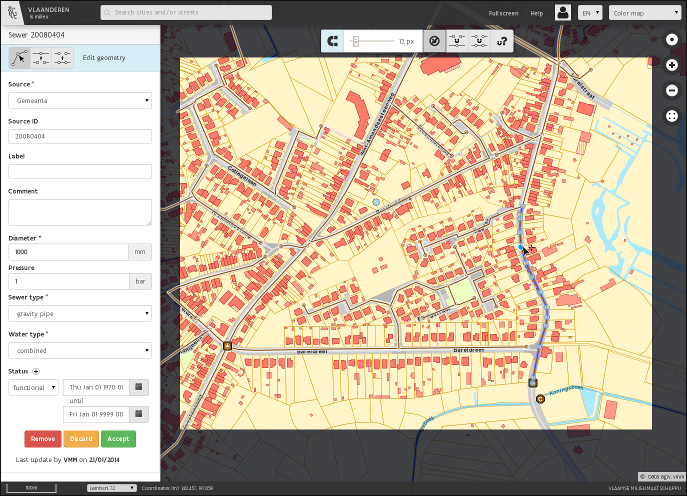

# eenvplus-geoloket 

Based on [mf-geoadmin3](https://github.com/geoadmin/mf-geoadmin3), this application allows Flemish cities to edit their
sewer network.

## Key differences with mf-geoadmin3

- Tailored to the Flemish region
- Limited scope of the viewer: for the time being only layers pertaining to the Flemish sewer system are available
- Enhanced editing features:
    - editing only allowed for authenticated users
    - advanced drawing tools to create and modify sewers and appurtenances
    - editing feature metadata
    - advanced validation of the modifications made to the sewer network
    - upload of [INSPIRE](http://inspire.ec.europa.eu/) compliant GML files
- A cross-platform build chain using [Grunt](http://gruntjs.com/)
- [TypeScript](http://www.typescriptlang.org/) as the main development language

**A sample sewer network editing session:**

[]

## Getting started

Checkout the source code:

    $ git clone git@github.com:VlaamseMilieumaatschappij/eenvplus-geoloket.git

Install build tools:

    $ yum install nodejs     --- or whatever nodejs installer you have available for your OS
    $ npm install -g grunt-cli

Build:

    $ cd eenvplus-geoloket
    $ grunt build-dev

or to build a .war file for Java servers

    $ maven clean install

Test:

    $ grunt karma:test

Continuous build & test:

    $ grunt dev

Continuous integration:

[https://travis-ci.org/VlaamseMilieumaatschappij/eenvplus-geoloket](https://travis-ci.org/VlaamseMilieumaatschappij/eenvplus-geoloket)

Server side code:

See [eenvplus-sdi](https://github.com/VlaamseMilieumaatschappij/eenvplus-sdi)
